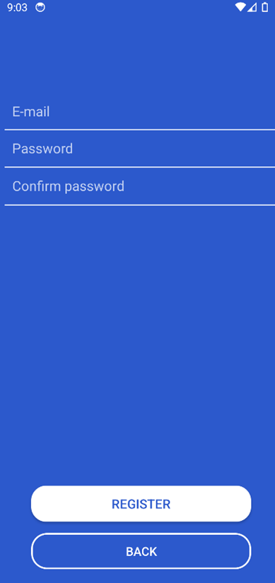
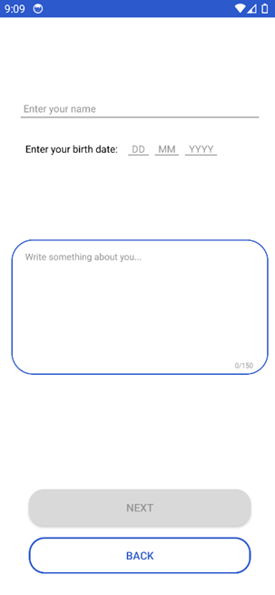
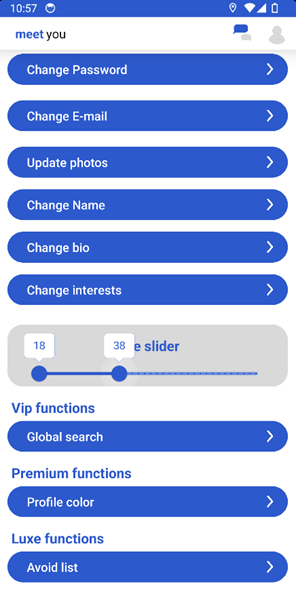

</img>

# Guide

## Beginning

To start using "MeetYou", you need to open it on your phone. App is availible for installation with .apk on Android smartphones.
After installation you need to run registration by tapping on button "Register" or log in using "Sign In"

## First Screen

## Registration

## Bio and Age

## User Profile

## Searching

## Chat

## Settings

## Subscriptions
